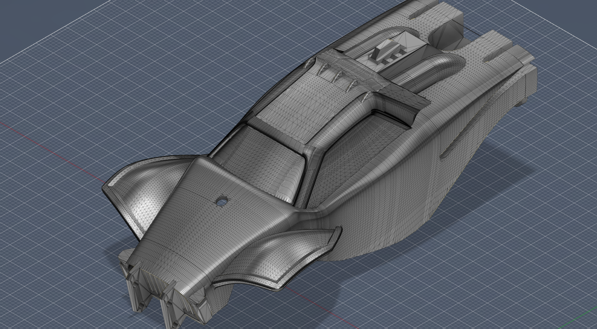

<!-- Improved compatibility of back to top link: See: https://github.com/othneildrew/Best-README-Template/pull/73 -->
<a name="readme-top"></a>
<!--
*** Thanks for checking out the Best-README-Template. If you have a suggestion
*** that would make this better, please fork the repo and create a pull request
*** or simply open an issue with the tag "enhancement".
*** Don't forget to give the project a star!
*** Thanks again! Now go create something AMAZING! :D
-->


<!-- PROJECT SHIELDS -->
<!--
*** I'm using markdown "reference style" links for readability.
*** Reference links are enclosed in brackets [ ] instead of parentheses ( ).
*** See the bottom of this document for the declaration of the reference variables
*** for contributors-url, forks-url, etc. This is an optional, concise syntax you may use.
*** https://www.markdownguide.org/basic-syntax/#reference-style-links
-->
[![Contributors][contributors-shield]][contributors-url]
[![Forks][forks-shield]][forks-url]
[![Stargazers][stars-shield]][stars-url]
[![Issues][issues-shield]][issues-url]
[![MIT License][license-shield]][license-url]


<!-- PROJECT LOGO -->
<br />
<div align="center">
  <a href="https://github.com/Sentientplatypus/octane7">
    
  </a>

<h3 align="center">Octane7</h3>

  <p align="center">
    A toy rocket league car that can jump and aerial.
    <br /> 
    <a href="https://github.com/Sentientplatypus/octane7"><strong>Explore the docs »</strong></a>
    <br />
    <br />
    <a href="https://github.com/Sentientplatypus/octane7">View Demo</a>
    ·
    <a href="https://github.com/Sentientplatypus/octane7/issues">Report Bug</a>
    ·
    <a href="https://github.com/Sentientplatypus/octane7/issues">Request Feature</a>
  </p>
</div>


<!-- TABLE OF CONTENTS -->
<details>
  <summary>Table of Contents</summary>
  <ol>
    <li>
      <a href="#about-the-project">About The Project</a>
      <ul>
        <li><a href="#built-with">Built With</a></li>
      </ul>
    </li>
    <li>
      <a href="#getting-started">Getting Started</a>
      <ul>
        <li><a href="#prerequisites">Prerequisites</a></li>
        <li><a href="#installation">Installation</a></li>
      </ul>
    </li>
    <li><a href="#usage">Usage</a></li>
    <li><a href="#roadmap">Roadmap</a></li>
    <li><a href="#contributing">Contributing</a></li>
    <li><a href="#license">License</a></li>
    <li><a href="#contact">Contact</a></li>
    <li><a href="#acknowledgments">Acknowledgments</a></li>
  </ol>
</details>


<!-- ABOUT THE PROJECT -->
## About The Project

[![Product Name Screen Shot][product-screenshot]](https://example.com)

I was playing rocket league one day. "dang these cars are cool, what if I made one?" So I sat down my boys and pitched the idea. I proposed some ideas for the jumping, and propulsion, and we had a good discussion. This is going to work. We will make a toy rocket league car that can jump, and do aerials.

There are 4 subsystems on the robot we needed to tackle
#### Engine
This is the easiest part. Slap a dc motor onto the back wheels.
#### Steering
Steve handled this. You see, real cars dont just have a servo that turns the wheels the same amount, as the outer wheels need to turn less than the inner wheels. Steve designed a differential, along with a steering mechanism.

#### Propulsion/boost
I worked on this part. We thought of using combustible rockets, then jet engines, and finally decided on an EDF. I caded multiple designs (one of them is shown above) and had Mukund print and test them.

#### Jumping
I also worked on this part. I looked up jumping robots, and found a good spring loaded flea like mechanism that looked promising. I printed a prototype, and it can jump quite a bit! However, we are also considering using the jumper from the spider jumping rc car toy. The downside would that it would be pushing off the ground itself instead of the wheels.
[![jumper mechanism][jumper]]()
<p align="right">(<a href="#readme-top">back to top</a>)</p>


### Built With

* [![Next][python]][python-url]
* [![Next][rpi]][rpi-url]

<p align="right">(<a href="#readme-top">back to top</a>)</p>


<!-- GETTING STARTED -->
## Getting Started

First clone this repository. Then, wire up your RPI to an L298N motor driver as so: (insert diagram) Additionally, you want a second L298N for the steering, and another for boost.

### Prerequisites

These prerequisites should already be preinstalled on the raspberry pi.
* npm
  ```sh
  pip3 install pygame
  ```

### Installation


1. Clone the repo
   ```sh
   git clone https://github.com/Sentientplatypus/octane7.git
   ```

And run `robot.py`. Its plug and play.

<p align="right">(<a href="#readme-top">back to top</a>)</p>


<!-- USAGE EXAMPLES -->
## Usage

Use this space to show useful examples of how a project can be used. Additional screenshots, code examples and demos work well in this space. You may also link to more resources.

_For more examples, please refer to the [Documentation](https://example.com)_

<p align="right">(<a href="#readme-top">back to top</a>)</p>


<!-- ROADMAP -->
## Roadmap

- [X] CAD + Designs
- [ ] Printing/purchasing parts
- [ ] Raspberry PI wiring
- [ ] Programming subsystems
    - [ ] Rewriting the code such that it follows a nice project structure that would make Mr. Deppe proud.
- [ ] Testing

See the [open issues](https://github.com/Sentientplatypus/octane7/issues) for a full list of proposed features (and known issues).

<p align="right">(<a href="#readme-top">back to top</a>)</p>


<!-- CONTRIBUTING -->
## Contributing

Contributions are what make the open source community such an amazing place to learn, inspire, and create. Any contributions you make are **greatly appreciated**.

If you have a suggestion that would make this better, please fork the repo and create a pull request. You can also simply open an issue with the tag "enhancement".
Don't forget to give the project a star! Thanks again!

1. Fork the Project
2. Create your Feature Branch (`git checkout -b feature/AmazingFeature`)
3. Commit your Changes (`git commit -m 'Add some AmazingFeature'`)
4. Push to the Branch (`git push origin feature/AmazingFeature`)
5. Open a Pull Request

<p align="right">(<a href="#readme-top">back to top</a>)</p>


<!-- LICENSE -->
## License

Distributed under the MIT License. See `LICENSE.txt` for more information.

<p align="right">(<a href="#readme-top">back to top</a>)</p>


<!-- CONTACT -->
## Contact

Geneustace Wicaksono - [My Website](https://genewica.herokuapp.com) - geneustacewicaksono@yahoo.com

Project Link: [https://github.com/Sentientplatypus/octane7](https://github.com/Sentientplatypus/octane7)

<p align="right">(<a href="#readme-top">back to top</a>)</p>


<!-- ACKNOWLEDGMENTS -->
## Acknowledgments

* [Mukund Gaur]()
* [Steve Arda Griffin]()

<p align="right">(<a href="#readme-top">back to top</a>)</p>


<!-- MARKDOWN LINKS & IMAGES -->
<!-- https://www.markdownguide.org/basic-syntax/#reference-style-links -->
[contributors-shield]: https://img.shields.io/github/contributors/Sentientplatypus/octane7.svg?style=for-the-badge
[contributors-url]: https://github.com/Sentientplatypus/octane7/graphs/contributors
[forks-shield]: https://img.shields.io/github/forks/Sentientplatypus/octane7.svg?style=for-the-badge
[forks-url]: https://github.com/Sentientplatypus/octane7/network/members
[stars-shield]: https://img.shields.io/github/stars/Sentientplatypus/octane7.svg?style=for-the-badge
[stars-url]: https://github.com/Sentientplatypus/octane7/stargazers
[issues-shield]: https://img.shields.io/github/issues/Sentientplatypus/octane7.svg?style=for-the-badge
[issues-url]: https://github.com/Sentientplatypus/octane7/issues
[license-shield]: https://img.shields.io/github/license/Sentientplatypus/octane7.svg?style=for-the-badge
[license-url]: https://github.com/Sentientplatypus/octane7/blob/master/LICENSE.txt
[linkedin-shield]: https://img.shields.io/badge/-LinkedIn-black.svg?style=for-the-badge&logo=linkedin&colorB=555
[linkedin-url]: https://linkedin.com/in/linkedin_username
[product-screenshot]: engine.png
[jumper](jumper.png)
[body](body.png)
[python]: https://img.shields.io/badge/Python-3776AB?style=for-the-badge&logo=python&logoColor=white
[python-url]: https://python.com
[rpi]: https://img.shields.io/badge/Raspberry%20Pi-A22846?style=for-the-badge&logo=Raspberry%20Pi&logoColor=white
[rpi-url]: https://raspberrypi.com
